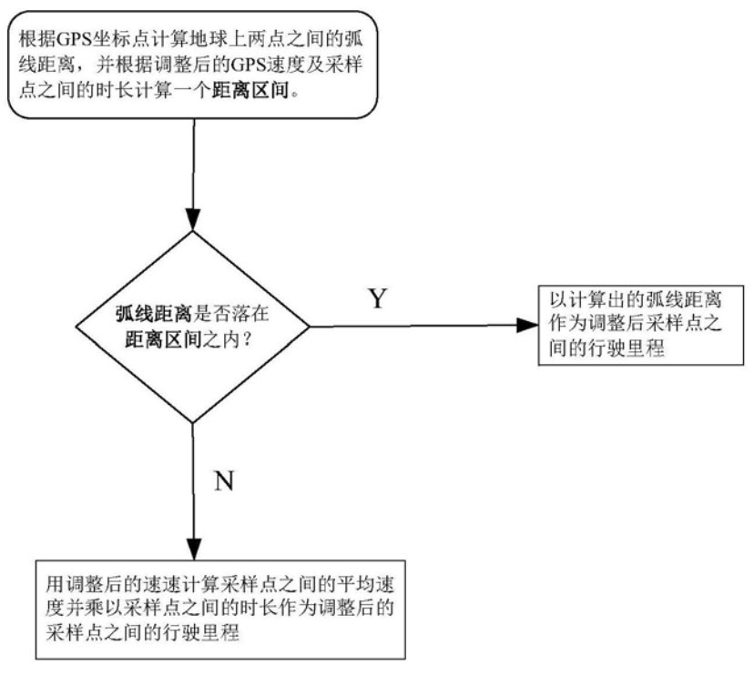

190401

**数据预处理部分**

1. 噪声的处理：主要针对GPS坐标漂移点
2. 补点：针对每一条GPS数据，补四个数据项 (latitude, langitude, time, speed)
经纬度坐标和GPS速度：按照平均值进行计算，根据上下两条数据计算平均值。因为这个时候已经将异常值去掉了，所以可以不用和那条专利中考虑的速度的速度要经过比较来计算之类的。
3. 数据压缩：主要针对后续计算，有很多值是不需要的，比如说停车时间过长的数据，即GPS数据除了 **时间(Time)**那一项不同之外，其余项都是相同的。

**线路聚合问题**
问题一中，题目考虑的是每辆车每条线路的行车里程，我们现在不能确定每辆车行驶的都是一条常规运输路线。
因为在  **一、问题背景**  中提出 **某运输企业所辖各车辆均存在常规运输路线与驾驶人员。**这里提到的是均存在常规运输路线，这里大胆假设该车辆的行驶路线中，不全是常规运输路线，是存在某一部分的运输路线，那么我们就可以通过 **线路聚合**得到所需要的常规运输路线。进而求得每辆车的行车里程、平均速度以及急加速急减速情况。
（这里有个问题，假如真的存在路线重叠，那么这重叠的一部分就是常规运输路线吗？那我们提交的是每一段常规运输路线下的行车里程、平均速度吗？这样的十辆车在每段运输路线上的行车里程应该是大致相同的吧？）

**计算里程的方式**

1. 根据GPS速度求里程，这个算是守门员
2. 根据经纬度坐标求里程。
根据上述两种方式求得的里程后，进行对比分析验证，从而得到更为精确的里程数据。如下图

**第二问：建立行车安全的评价模型 **

这一问暂且通过建立一个神经网络的模型，本质上是个分类的问题，至于是多分类还是二分类再根据问题细分。

先挖掘不良的驾驶行为：
主要包括题目提示的内容（疲劳驾驶、急加速、急减速、怠速预热、超长怠速、熄火滑行、超速、急变道等）

再建立行车安全的评价模型

最后给出评价结果